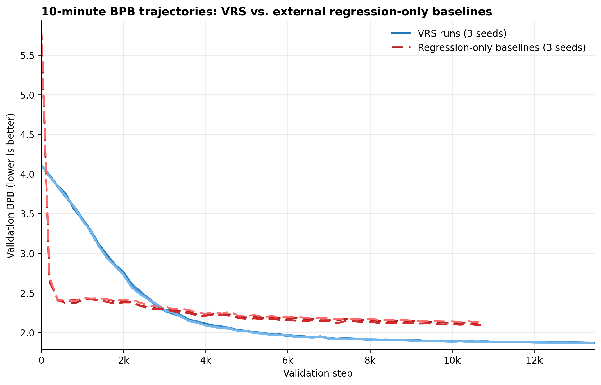
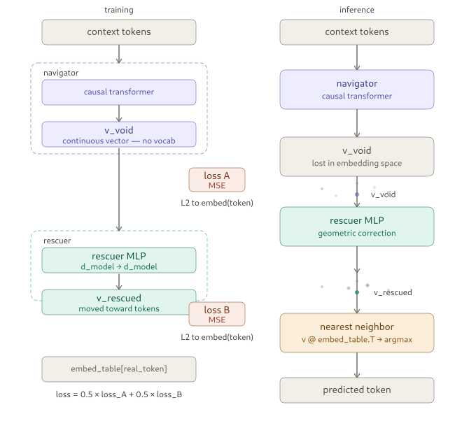
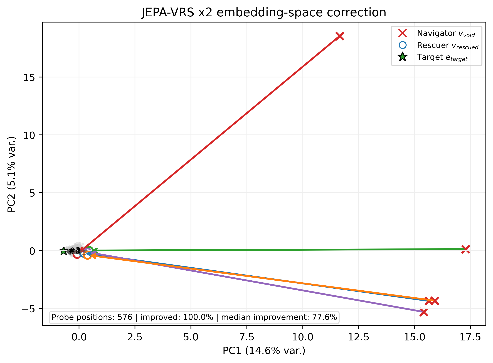
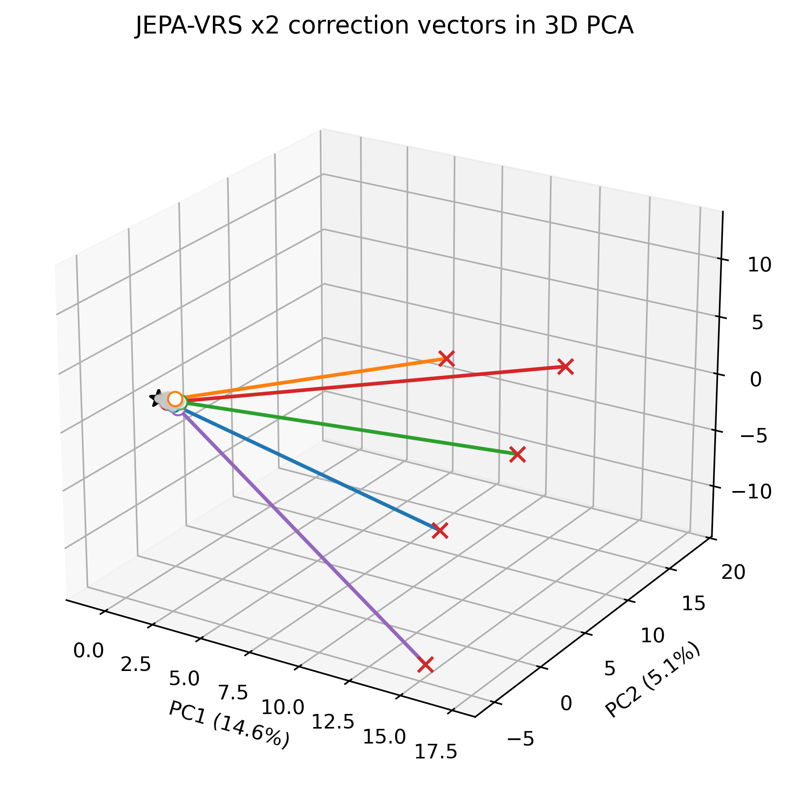
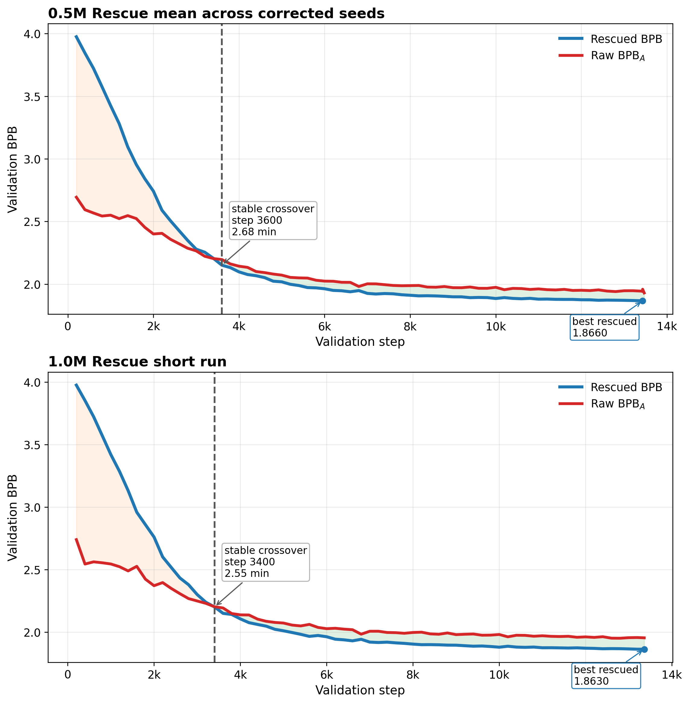
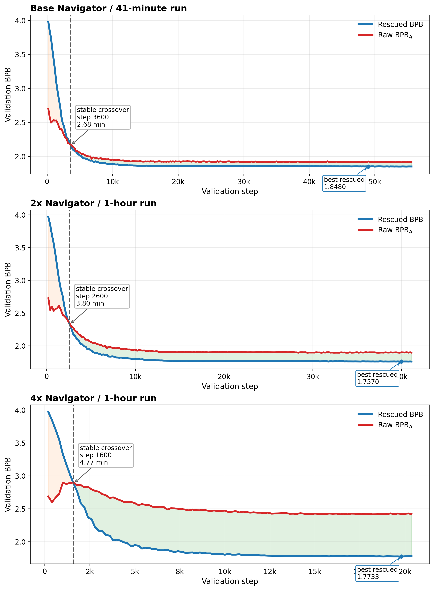

# VRS: Void Rescue System
**A new geometric rescue method for regression-based token prediction in transformers**

**High-school student entry for OpenAI Parameter Golf 2026**  
*Iker Moel Tacher — Mexico City, April 8, 2026*

**DOI:** `10.5281/zenodo.19477224`

---

## The Idea

In regression-based language modeling, the model predicts **continuous embedding vectors** instead of vocabulary logits. These latents often contain useful token information, but they can still decode poorly because they land in ambiguous or weakly aligned regions of embedding space.

I call these regions **voids**.

**VRS (Void Rescue System)** is the proposed rescue mechanism: a tiny, context-free MLP with only **524k parameters** that takes the raw regression latent `v_void` and maps it to a better-aligned `v_rescued` before final decoding through the shared embedding table.

It is not presented as a generic efficiency trick. It is a **new auxiliary decoder** aimed at a geometric decoding failure mode specific to regression.

## Why This Matters

- It gives an explicit geometric interpretation of a regression-specific decoding failure.
- It shows that a **very small jointly learned rescuer** can improve decoding from informative but misaligned latents.
- It works across short runs, longer runs, and larger Navigators up to **66.7M** parameters.
- The main 0.5M Rescuer fits inside the **16 MB** artifact limit used in Parameter Golf.

This is exploratory research on how transformers behave under regression training. It is not a claim that regression is globally better than classification.

## Key Results

| Setting | Navigator | Rescuer | Duration | Rescued BPB | Raw BPB (internal) | Gain | Peak `nn_acc` | Crossover |
|---|---:|---:|---:|---:|---:|---:|---:|---:|
| Base average | 17.06M | 0.524M | 10 min | 1.8667 | 1.9401 | +0.0734 | 50.51% | step 3600 |
| Base | 17.06M | 0.524M | 41 min | 1.8480 | 1.9091 | +0.0611 | 51.04% | step 3600 |
| 2x | 33.60M | 0.524M | 1 h | 1.7570 | 1.8913 | +0.1343 | 53.35% | step 2600 |
| 4x | 66.67M | 0.524M | 1 h | 1.7733 | 2.4144 | **+0.6411** | 55.34% | step 1600 |

The strongest pattern is that VRS improves **BPB much more than top-1 accuracy**, which is consistent with the interpretation that the Rescue path helps more with full decoded distribution quality than with top-1 recovery alone.

## Regression-Only Baseline vs VRS

To make the comparison fairer, this repo also includes **three separately trained regression-only baselines** with no Rescuer.

| Model | Duration | Seeds | Min BPB | Avg / Range `nn_acc` | Artifact MB |
|---|---:|---:|---:|---:|---:|
| Regression-only baseline | 10 min | 3 | 2.0941-2.1301 | 50.05%-50.18% | 15.19-15.23 |
| VRS (0.5M Rescuer) | 10 min | 3 | 1.8658-1.8679 | 50.32%-50.67% | 15.93-15.94 |

This matters because `val_bpb_A` is only an **internal raw-path probe** inside a jointly trained VRS system. The three standalone regression baselines provide a real external reference, and VRS still wins clearly on BPB.

### Stepwise Comparison

**Figure 5** compares the 10-minute VRS runs against the three external regression-only baselines.



## Visual Proof of the Rescue Effect

**Figure 1** shows the training and inference pipeline: Navigator, Rescue model, and shared embedding-table decoding.



**Figure 6A** shows the 2D PCA view of target embeddings, raw Navigator outputs, and rescued outputs.



**Figure 6B** shows the corresponding 3D PCA view.



**Figure 2** and **Figure 3** show that the rescue effect appears early and stays better than raw decoding after crossover.





## Repository Contents

- [docs/vrs_void_rescue_system_for_regression_transformers.pdf](docs/vrs_void_rescue_system_for_regression_transformers.pdf)  
  Full paper PDF.
- [figures/](figures/)  
  Extracted figures from the paper plus generated geometry visualizations.
- [metrics/vrs_metrics_master.xlsx](metrics/vrs_metrics_master.xlsx)  
  Master workbook with VRS runs, external regression baselines, and extra-testing ablations.
- [vrs/train_jepa_vrs.py](vrs/train_jepa_vrs.py)  
  Main corrected VRS training script.
- [vrs/baseline/train_jepa_regression_baseline.py](vrs/baseline/train_jepa_regression_baseline.py)  
  Standalone regression-only baseline script.
- [vrs/runs/submitable_10min/](vrs/runs/submitable_10min/)  
  Original 10-minute submitable runs, logs, scripts, and artifacts.
- [vrs/runs/extra_testing/](vrs/runs/extra_testing/)  
  Linear-rescuer and freeze ablations.
- [vrs/docs/vrs-spec.txt](vrs/docs/vrs-spec.txt)  
  Final technical implementation spec.

## Reproduction Commands

Main corrected 1-hour VRS run:

```bash
MAX_WALLCLOCK_SECONDS=3600 LR_WALLCLOCK_SECONDS=600 LR_MIN_SCALE=0.02 ITERATIONS=100000 WARMDOWN_ITERS=20000 RESCUER_LR=0.04 SEED=42 torchrun --standalone --nproc_per_node=8 vrs/train_jepa_vrs.py
```

Original 10-minute submitable VRS run:

```bash
MAX_WALLCLOCK_SECONDS=600 ITERATIONS=20000 WARMDOWN_ITERS=20000 RESCUER_LR=0.04 SEED=42 torchrun --standalone --nproc_per_node=8 vrs/runs/submitable_10min/scripts/vrs_golf_parameter.py
```

Standalone regression-only baseline:

```bash
MAX_WALLCLOCK_SECONDS=600 ITERATIONS=20000 WARMDOWN_ITERS=20000 SEED=42 torchrun --standalone --nproc_per_node=8 vrs/baseline/train_jepa_regression_baseline.py
```

Linear-Rescuer ablation:

```bash
MAX_WALLCLOCK_SECONDS=600 ITERATIONS=20000 WARMDOWN_ITERS=20000 RESCUER_LR=0.04 RESCUER_ARCH=linear FREEZE_NAVIGATOR_AT_HALF=0 SEED=42 torchrun --standalone --nproc_per_node=8 vrs/runs/extra_testing/scripts/vrs_golf_parameter_freeze_linear.py
```

Freeze-Navigator ablation:

```bash
MAX_WALLCLOCK_SECONDS=600 ITERATIONS=20000 WARMDOWN_ITERS=20000 RESCUER_LR=0.04 RESCUER_ARCH=mlp FREEZE_NAVIGATOR_AT_HALF=1 FREEZE_NAVIGATOR_FRACTION=0.5 SEED=42 torchrun --standalone --nproc_per_node=8 vrs/runs/extra_testing/scripts/vrs_golf_parameter_freeze_linear.py
```

## Citation / Contact

```bibtex
@misc{tacher2026vrs,
  title  = {VRS: Void Rescue System for Regression in Transformers},
  author = {Iker Moel Tacher},
  year   = {2026},
  doi    = {10.5281/zenodo.19477224},
  note   = {High-school independent research for OpenAI Parameter Golf},
  url    = {https://github.com/ikermoel/VRS-Void-Rescue-System}
}
```

Open to feedback, questions, and collaboration.
